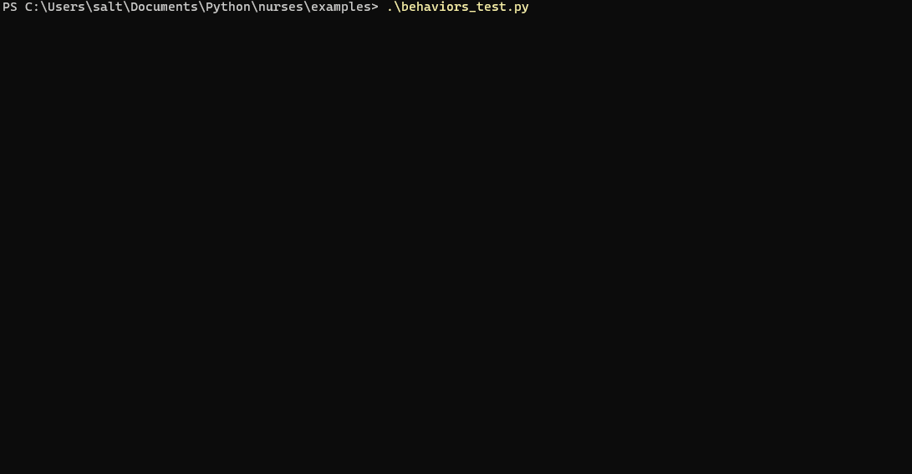

# Nurses

A portmanteau of Numpy and Curses.  This library aims to implement curses widgets that have similar api to both
numpy arrays and typical GUI widgets.

# /examples/exploding_logo.py:

# /examples/code_rain_logo.py

# /examples/async_test.py:

# /examples/behaviors_test.py:

# /examples/pad_test.py

